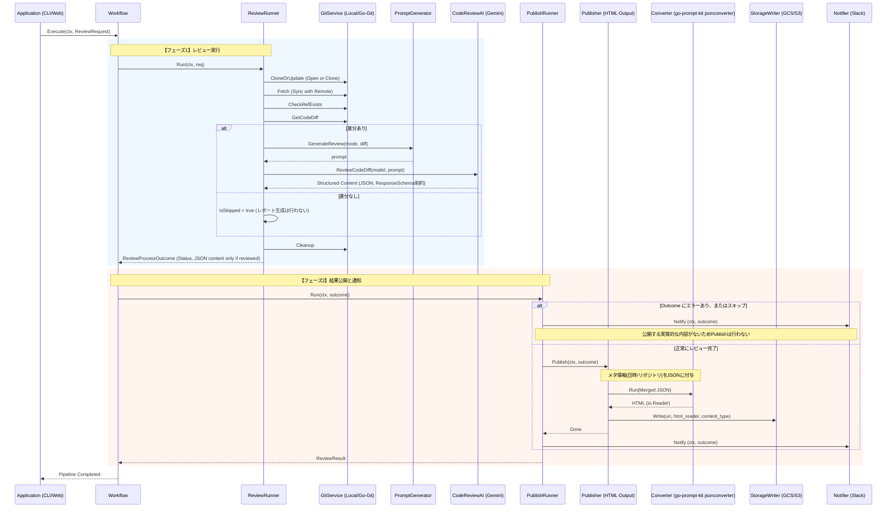

# 🤖 Go Review Kit

[](https://github.com/shouni/gemini-reviewer-core/actions/workflows/ci.yml)
[](https://golang.org/)
[](https://golang.org/)
[](https://github.com/shouni/gemini-reviewer-core/tags)
[](https://opensource.org/licenses/MIT)
[](https://pkg.go.dev/github.com/shouni/gemini-reviewer-core)
[](#)

## 🚀 概要 (About)

**Go Review Kit** は、Gitリポジトリのブランチ間の差分をGoogle Gemini APIでレビューし、結果を公開するまでの一連の処理をまとめたコアエンジンです。

「Git操作 → 差分抽出 → AIレビュー → 結果公開」という流れをライブラリとして切り出しています。

AIの出力はGeminiのResponseSchemaでJSON構造化して安定させているため、コードに限らず、Markdown原稿のレビューなど呼び出し側の用途に応じて柔軟に使えます。

---

## 🎯 特徴 (Key Features)

### 実行環境の切り替え
* **ワークフローの共通化:** レビューの「手順」が Core パッケージに集約されているため、CLI でも Web でも同一のロジック・品質でレビューが動作します。
* **環境に応じた実行戦略:** サーバーレス環境（`go-git`）とローカル環境（`os/exec`）を用途に応じて切り替え可能です。
* **マルチクラウド対応:** GCS/S3 への公開を `ports` で抽象化し、保存先を問わず扱えます。

### Git 操作
* **柔軟な参照解決:** ブランチ名だけでなく、コミットハッシュ（`f921111` 等）を直接指定したレビューが可能です。
* **安全な解決優先順位:** 数字のみのブランチ名（チケット番号等）でも、ハッシュ値より先にリモートブランチを探索し、意図しない Detached HEAD を防ぎます。
* **クリーンアップ:** 実行のたびに `git checkout -f` および `git clean -f -d` を実行し、クリーンな状態でレビューを開始します。

### アーキテクチャ
* **DIP（依存性逆転の原則）:** ヘキサゴナルアーキテクチャ（Ports and Adapters）に基づき、ストレージや AI モデルの切り替えがしやすい構成です。
* **テスト容易性:** インターフェース（Ports）中心の設計のため、モックへの差し替えが容易です。

---

## 📂 プロジェクト構造 (Project Structure)

本ライブラリは、「核心的な契約（Ports）」「実行ロジック（Workflow/Runner）」「具体的な実装（Adapters）」をパッケージレベルで厳密に分離しています。

### 📦 プロジェクトの責務 (Project Responsibilities)

| カテゴリ | パッケージ | 役割と責務 |
| :--- | :--- | :--- |
| **Core (契約)** | **`ports`** | すべてのインターフェースとデータ構造を定義。プロジェクトの「憲法」です。 |
| **Logic (実行)** | **`workflow`** | レビューの全体工程（Git → AI → Publish）を制御するオーケストレーターです。 |
| | **`runner`** | 「レビュー生成」や「結果公開」といった、各工程の具体的な実行ロジックです。 |
| **Adapter (実装)** | **`git`** | リポジトリ操作の実体。`go-git` または Local CLI を切り替え可能です。 |
| | **`ai`** | Gemini API との通信を担当。ResponseSchemaで構造化出力(JSON)を制約し、安定した結果を返します。 |
| | **`publisher`** | 結果の HTML 変換や、マルチクラウドストレージへの保存を担当します。 |

### 🖇 プロジェクトツリー (Project Tree)

```text
gemini-reviewer-core
├── ports/          # 核心：Interface 定義 (ai.go, git.go, publisher.go, workflow.go)
├── runner/         # 実行：単一工程のロジック (review.go, publish.go)
├── workflow/       # 指揮：全体のパイプライン制御 (workflow.go)
├── ai/             # 実装：Gemini API アダプター
├── git/            # 実装：Git 操作アダプター (Local/Go-Git)
└── publisher/      # 実装：成果物出力アダプター (JSON→HTML/Storage)
```

---

## 🔄 シーケンスフロー (Sequence Flow)



> **Note:** `ai.GeminiAdapter` は、AIの自由記述に起因する出力揺れを避けるため ResponseSchema で
> 制約した **JSON文字列**(`{title, summary, verdict: {decision, reason}, findings: [{severity, file,
> line, excerpt, message, suggestion}]}`。`severity` は `Blocker`/`Major`/`Minor`、`verdict.decision` は
> それに `None` を加えた4値のenumで制約)を
> `ReviewCodeDiff` の戻り値として返します。
> `Publisher`/`Converter` は go-prompt-kit の `jsonconverter` を使いこのJSONを直接HTML化するため、
> Markdownへの変換は不要です。公開する実質的な内容があるのは成功時のみのため、エラー時・スキップ時は
> `Publisher.Publish`(HTML化・ストレージ保存)を行わず、`Notifier.Notify` のみを実行します。

## 🧩 Git 操作アダプターの選択

実行環境に合わせて、2種類の Git 操作アダプターを選択できます。

| 特徴 | Adapter | LocalAdapter |
| --- | --- | --- |
| **戦略** | 純粋な Go 実装 (`go-git`) | 外部コマンド (`git`) |
| **更新** | **Fetch 主体 (エフェメラル)** | **Fetch & Reset 主体 (状態管理)** |
| **強み** | OS 非依存、インメモリ操作 | 強力なクリーンアップ、高速な差分抽出 |
| **認証** | Go 内での認証管理 | OS 標準 (SSH/Agent/Config) |
| **制御** | `context.Context` に完全準拠 | `exec.CommandContext` でタイムアウト制御 |
| **適性** | サーバーレス・コンテナ環境 | ローカル開発・CI パイプライン |

---

## ✨ 技術スタック (Technology Stack)

| 要素 | 技術 / ライブラリ | 役割 |
| --- | --- | --- |
| **言語** | **Go (Golang)** | ライブラリの開発言語。 |
| **Git 操作** | **[`go-git`](https://github.com/go-git/go-git)** | クローン、フェッチ、**3-dot diff** の取得まで完結。SSH 認証とホストキー検証を統合。 |
| **AI 推論** | **[`go-gemini-client`](https://github.com/shouni/go-gemini-client)** | Gemini API へのアクセス。リトライ等を備えた通信 SDK をラッピングして提供。 |
| **JSON→HTML 変換** | **[`go-prompt-kit`](https://github.com/shouni/go-prompt-kit)** | 構造化されたレビュー結果JSON(`jsonconverter`)を、スタイル付きの完全な HTML ドキュメントに変換。 |

---

### 📜 ライセンス (License)

このプロジェクトは [MIT License](https://opensource.org/licenses/MIT) の下で公開されています。

---
