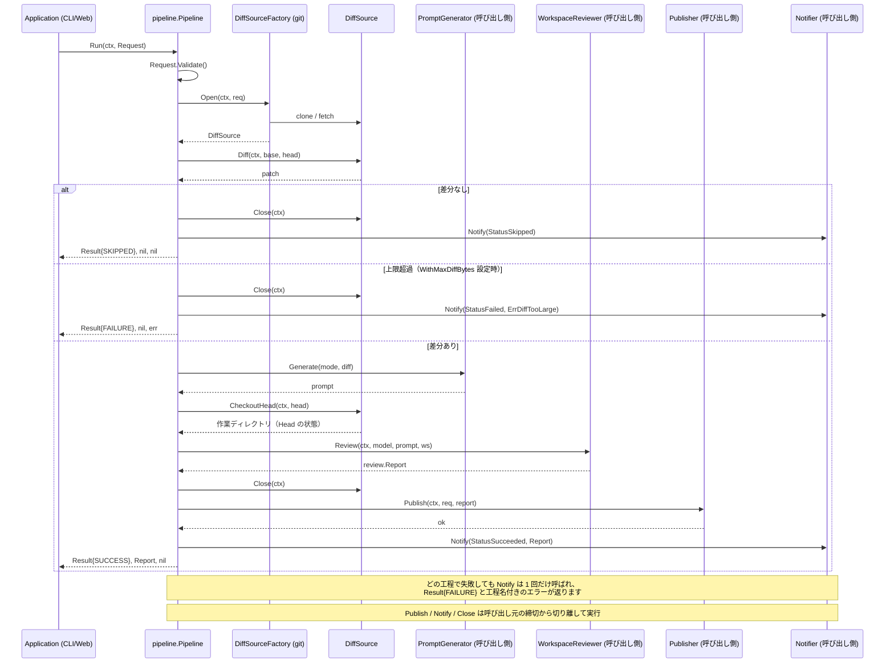

# 🤖 Go Review Kit

[](https://github.com/shouni/go-review-kit/actions/workflows/ci.yml)
[](#)
[](https://go.dev/)
[](https://go.dev/)
[](https://github.com/shouni/go-review-kit/tags)
[](https://opensource.org/licenses/MIT)
[](https://pkg.go.dev/github.com/shouni/go-review-kit)

## 🚀 概要 (About) - 差分を取り、AI に読ませ、保存して、通知する。AI SDK は持たない

**Go Review Kit** は、「Git の差分を取る → AI にレビューさせる → 結果を保存する → 通知する」を
1 本のパイプラインとして提供するライブラリです。`main` パッケージは持ちません。

レビュー結果は型付きの `review.Report`（判定・重大度付きの指摘）として受け渡し、`ParseReport` が
解釈と検証を引き受けます。AI SDK には依存しないため、コードに限らず Markdown 原稿のレビューなど、
実装次第で用途を変えられます。

### 扱わないこと

**レビュアー・プロンプトの文面・保存先・通知先は、いずれも呼び出し側の実装です。**
どの AI SDK でレビューするか（`review.WorkspaceReviewer`）、どんな文面で指示するか
（`review.PromptGenerator`）、JSON で残すのか HTML に整形して GCS / S3 / DB のどこへ置くのか
（`review.Publisher`）、どこへ知らせるか（`review.Notifier`）は、いずれも表示や運用の作りに
従属する決定です。ライブラリ側に既定を持たせると、全利用者が要らないレンダリングと依存を
抱えることになります。直接依存は `go-git` だけです。

---

## ✨ 提供機能 (Features)

* **参照はブランチに限りません** — タグやコミットハッシュも直接指定できます。解決は常に
  「リモートブランチ → コミット」の順なので、数字だけのブランチ名（チケット番号など）が
  短縮ハッシュとして解決され、意図しないコミットの差分を取ってしまうことがありません。
* **3 点比較** — マージベースを起点にするため、base 側で進んだコミットが差分に混ざりません。
* **上限を実測から決められます** — `Result` に差分の大きさ・所要時間・モデルの使用量・ツール
  呼び出し回数が載ります。**失敗した実行でも埋まります。** 上限が厳しすぎるかどうかを判断する
  材料は、通った実行より弾かれた実行の側にあるためです。
* **レビュアーはエージェント型** — `WorkspaceReviewer` は Head をチェックアウトした作業ディレクトリを
  自分で調べられます。差分の外を確認できることが前提なので、「ファイルを開いて確かめろ」
  「確認した根拠を挙げろ」と書いたプロンプトが常に成立します。
* **モデルが混ぜたノイズを吸収します** — 構造化出力を指定しても、モデルは Markdown のフェンス、
  末尾の説明文、エスケープし忘れたバックスラッシュ、生の改行を混ぜることがあります。
  **応答を返しきったあとの崩れなので API の再試行では直りません。** `ParseReport` は、そのまま
  解釈できたときは何もせず、失敗したときだけ補修を試します。

---

## 📦 パッケージ構成 (Package Structure)

| カテゴリ | パッケージ | 役割と責務 |
| :--- | :--- | :--- |
| **契約** | **`review`** | ドメイン型・番兵エラー・全ポートの定義。他のどのパッケージにも依存しません |
| **実行** | **`pipeline`** | 準備 → 差分 → プロンプト → Head チェックアウト → AI → 保存 → 通知 を制御し、結果を返します |
| **実装** | **`git`** | `review.DiffSource` の実体。`GoGit`（純 Go・使い捨て環境向き）と `CLI`（`git` バイナリを使い、チェックアウトを再利用できる環境向き） |

`git` のどちらを使うかは呼び出し側が選びます（本ライブラリは選択しません）。各型・ポート・
オプションの詳細は [pkg.go.dev](https://pkg.go.dev/github.com/shouni/go-review-kit) にあります。

---

## 🚦 使い方 (Usage)

`pipeline.Deps` に実装を差し込んで `Run` を呼びます。

```go
// reviewer / publisher / notifier / prompts は呼び出し側の実装です。
func run(
	ctx context.Context,
	reviewer review.WorkspaceReviewer,
	publisher review.Publisher,
	notifier review.Notifier,
	prompts review.PromptGenerator,
) error {
	sources, err := git.NewGoGitFactory("/var/tmp/reviews", git.WithSSHKey("~/.ssh/id_ed25519"))
	if err != nil {
		return err
	}

	p, err := pipeline.New(pipeline.Deps{
		Sources:           sources,
		Prompts:           prompts,
		WorkspaceReviewer: reviewer,
		Publisher:         publisher,
		Notifier:          notifier,
	})
	if err != nil {
		return err
	}

	result, report, err := p.Run(ctx, review.Request{
		JobID:      "20260810-213000-a1b2c3d4", // 任意。呼び出し側が持つ相関ID
		RepoURL:    "ssh://git@github.com/shouni/example.git",
		Base:       "main",
		Head:       "develop",
		Mode:       "code", // 任意の文字列。意味づけは PromptGenerator の実装が決めます
		Model:      modelName,
		StorageURI: "gs://bucket/reviews/20260810-213000-a1b2c3d4/report.json",
		PublicURL:  "https://example.com/history/20260810-213000-a1b2c3d4",
	})
	if err != nil {
		// 工程名はエラー自身が持つので、別のフィールドと突き合わせる必要はありません。
		// 種類は review.ErrInvalidRequest / ErrRefNotFound / ErrUnsupportedRepoURL /
		// ErrDiffTooLarge を errors.Is で判別できます。
		log.Printf("%s で失敗しました: %v", review.StepOf(err), err)
		return err
	}

	// report はレビューが成立した場合のみ非 nil です。差分が無ければ nil で返ります。
	log.Printf("status=%s published=%v duration=%s",
		result.Status, result.Published(), result.Duration)
	return nil
}
```

---

## 🔑 リポジトリURLは SSH 形式だけ (SSH only)

認証は SSH 鍵だけを扱うため、受け付けるのは scp 形式（`git@github.com:owner/repo.git`）・
`ssh://` スキーム・ローカルパス（開発とテスト用）です。**`http(s)` は `Prepare` が形式のエラーとして
明示的に断ります。** 資格情報を渡す経路が無く、公開リポジトリへ匿名で繋がるだけなので、対応して
いるように見えて private では必ず失敗するためです。断り方を形式のエラーにしておくと、利用者が
「認証に失敗しました」で悩まずに済みます。同じリポジトリを scp 形式と `ssh://` のどちらで指定
しても、同じ作業ディレクトリへ落ち着きます。

**同じリポジトリのレビューを同時に走らせる場合は `WithDirNamer` が要ります。** 既定の作業
ディレクトリ名は URL だけから決まり、本ライブラリは排他を行いません。`CLI` では**エラーにならずに
別ブランチの内容をレビューします**（`GoGit` では先に終わった側が実行中の側のディレクトリを消します）。

---

## 📐 動作の約束 (Behavioural Contract)

呼び出し側が前提にしてよい取り決めです。godoc に書ききれない、順序と締切の話が中心です。

* **`Notifier` は `Run` 1 回につき必ず 1 回呼ばれます。** 成功・スキップ・失敗のいずれでも呼ばれ、
  保存に失敗した場合も呼ばれます。報告がいちばん必要な場面で通知が飛ばない、という状態を
  作らないためです。裏を返すと、**`Run` に入る前に呼び出し側で失敗させた場合は呼ばれません**。
  レビュアーの選択などを `Run` の外で行う構成では、その経路の通知は呼び出し側の責任です。
* **保存・通知・後始末は呼び出し元の締切から切り離され、それぞれ独立した上限を持ちます
  （`pipeline.WithPublishTimeout`）。** レビューは重いので、レビューが打ち切られた直後は呼び出し元の
  context が期限切れです。そのまま使うと、失敗を報告する通知や後始末まで道連れで失敗します。
* **したがって、レビュー本体の上限は `Run` へ渡す context ではなく `pipeline.WithRunTimeout` で
  設定してください。** 自分で締切を被せると上の切り離しより外側に掛かり、打ち切りと同時に通知も
  落ちます。ジョブキューの応答待ちより短く取っておくと、外側に打ち切られる前に自分から諦めて、
  失敗を記録・通知してから終われます。
* **作業ディレクトリはレビューを終えた時点で解放されます（保存より前です）。**
  `DiffSource.Close` はレビューを抜けた直後に走るため、`Publisher` から作業ツリーを読むことは
  できません（`GoGit` はここでディレクトリごと削除します）。保存したい内容は `Report` に
  載せてください。
* **`ParseInfo.Truncated` を見ないと、切り詰めたレビューを完全なものとして公開します。**
  出力の上限に当たったモデルは文の途中で止まりますが、そこまでの指摘は正しい JSON として
  並んでいるため、全損にせず最後に閉じ終えた要素まで戻して返します。切れた先に指摘が何件
  あったかは分かりません。
* **差分が無いのは失敗ではありません**（`StatusSkipped` と `nil` が返ります）が、**差分が
  大きすぎるのは失敗です**（`pipeline.WithMaxDiffBytes`、既定は無制限）。範囲を絞れば通る入力なので
  利用者に手を打ってもらう必要があり、スキップにすると「レビューはしたが指摘が無かった」と
  見分けが付きません。
* **`Publisher` が呼ばれるのは成功時だけです。** 差分なし・失敗のときは公開する内容が存在しない
  ため、`Notifier` だけが呼ばれます。
* **通知の失敗はパイプラインを失敗させません。** 成果物は既に保存済みであり、不達を理由に結果を
  失敗へ倒すと再実行の判断を誤らせるためです（記録は残ります）。
* **レビューの中身を使う処理は `Run` の戻り値から組み立ててください。** ジョブ状態の記録などの
  ために `Notifier` を実装する必要はありません。`Notifier` は外向きの通知のためのもので、
  締切の切り離しが要らない処理をそこへ載せる理由はありません。

---

## 🔄 シーケンスフロー (Sequence Flow)



---

## 📜 ライセンス (License)

このプロジェクトは [MIT License](https://opensource.org/licenses/MIT) の下で公開されています。
