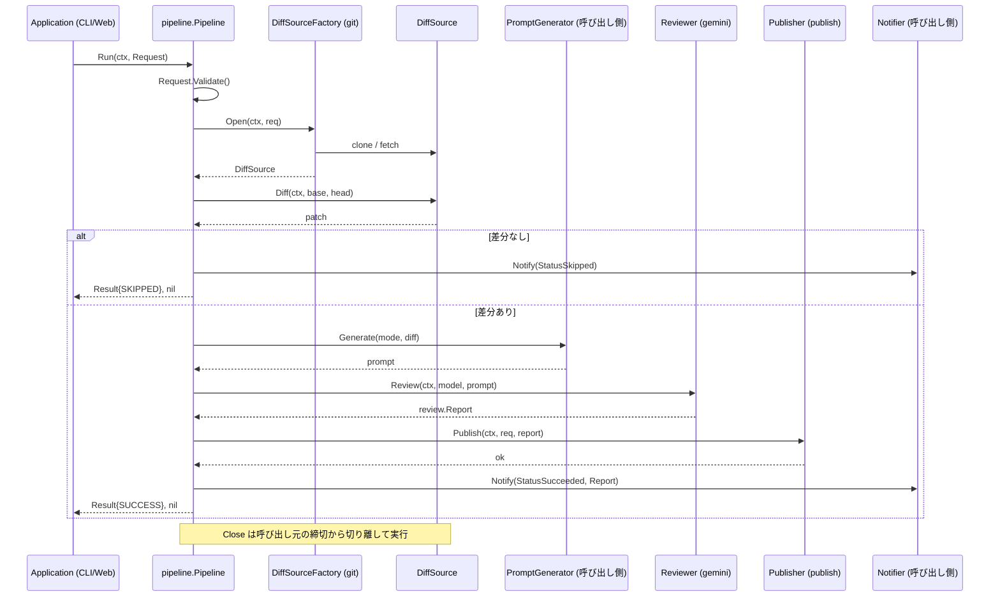

# 🤖 Go Review Kit

[](https://github.com/shouni/go-review-kit/actions/workflows/ci.yml)
[](https://golang.org/)
[](https://golang.org/)
[](https://github.com/shouni/go-review-kit/tags)
[](https://opensource.org/licenses/MIT)
[](https://pkg.go.dev/github.com/shouni/go-review-kit)

## 🚀 概要 (About)

**Go Review Kit** は、Git リポジトリのブランチ間の差分を AI でレビューし、結果を公開するまでの
一連の処理をまとめたライブラリです。

「Git 操作 → 差分抽出 → AI レビュー → 結果公開 → 通知」という流れを、呼び出し側が組み替えられる
形で切り出しています。バイナリは含みません（`main` パッケージはありません）。

AI の出力は Gemini の ResponseSchema で JSON 構造化したうえで `review.Report` へデコードするため、
コードに限らず Markdown 原稿のレビューなど、呼び出し側の用途に応じて柔軟に使えます。

> 本リポジトリは [`gemini-reviewer-core`](https://github.com/shouni/gemini-reviewer-core) の機能を
> 引き継いだ完全な再設計版です。移行にあたっての変更点は [設計上の変更点](#-設計上の変更点-design-changes)
> を参照してください。

---

## 🎯 特徴 (Key Features)

### 実行環境の切り替え
* **ワークフローの共通化:** レビューの手順は `pipeline` に集約されているため、CLI でも Web でも
  同一のロジックでレビューが動作します。
* **環境に応じた実行戦略:** `git.GoGit`（go-git・使い捨て環境向け）と `git.CLI`（ローカル git
  コマンド・チェックアウト再利用）を用途に応じて選べます。
* **マルチクラウド対応:** GCS / S3 への公開を `review.Publisher` で抽象化し、保存先を問わず扱えます。

### Git 操作
* **柔軟な参照解決:** ブランチ名だけでなく、タグやコミットハッシュ（`f921111` 等）を直接指定した
  レビューが可能です。
* **安全な解決優先順位:** 数字のみのブランチ名（チケット番号等）でも、ハッシュ値より先にリモート
  ブランチを探索し、意図しない Detached HEAD を防ぎます。
* **クリーンアップ:** `git.CLI` は実行のたびに基準参照へ戻して未追跡ファイルを削除し、`git.GoGit`
  は作業ディレクトリごと破棄します。

### アーキテクチャ
* **DIP（依存性逆転の原則）:** ヘキサゴナルアーキテクチャに基づき、ストレージや AI モデルの
  切り替えがしやすい構成です。
* **テスト容易性:** ポートが 1〜2 メソッドに絞られているため、モックへの差し替えが容易です。

---

## 📂 プロジェクト構造 (Project Structure)

### 📦 パッケージの責務 (Package Responsibilities)

| カテゴリ | パッケージ | 役割と責務 |
| :--- | :--- | :--- |
| **Core (契約)** | **`review`** | ドメイン型（`Request` / `Report` / `Result`）、番兵エラー、全ポートの定義。他のどのパッケージにも依存しません。 |
| **Logic (実行)** | **`pipeline`** | レビューの全工程（準備 → 差分 → プロンプト → AI → 公開 → 通知）を制御するオーケストレーターです。 |
| **Adapter (実装)** | **`git`** | 差分取得の実体。`GoGit`（go-git）と `CLI`（ローカル git）を切り替え可能です。 |
| | **`gemini`** | Gemini API との通信を担当。ResponseSchema で構造化出力を制約し、`review.Report` を返します。 |
| | **`publish`** | 結果の HTML 変換と、リモートストレージへの保存を担当します。 |

### 🖇 プロジェクトツリー (Project Tree)

```text
go-review-kit
├── review/          # 契約：ドメイン型とポート定義
│   ├── request.go   #   Request（New で検証、値として受け渡す）
│   ├── report.go    #   Report / Verdict / Finding / Severity / Decision
│   ├── result.go    #   Result / Status（SUCCESS / SKIPPED / FAILURE）
│   ├── errors.go    #   番兵エラーと StepError（工程名付きエラー）
│   └── ports.go     #   Reviewer / DiffSource / Publisher / Notifier ほか
├── pipeline/        # 指揮：Run(ctx, Request) (Result, error)
├── git/             # 実装：DiffSource（gogit.go / cli.go / refs.go / auth.go）
├── gemini/          # 実装：Reviewer（reviewer.go / schema.go）
└── publish/         # 実装：Publisher（JSON → HTML → ストレージ）
```

---

## 🧩 使い方 (Usage)

呼び出し側は、`pipeline.Deps` に実装を差し込んで `Run` を呼ぶだけです。
`PromptGenerator` は用途ごとに文面が変わるため、呼び出し側が実装します。

```go
package main

import (
	"context"
	"log"

	"github.com/shouni/go-review-kit/gemini"
	"github.com/shouni/go-review-kit/git"
	"github.com/shouni/go-review-kit/pipeline"
	"github.com/shouni/go-review-kit/publish"
	"github.com/shouni/go-review-kit/review"
)

func run(ctx context.Context, writer remoteio.Writer, notifier review.Notifier, prompts review.PromptGenerator) error {
	// 差分取得元（永続的な作業ディレクトリを使う場合は NewCLIFactory）
	sources, err := git.NewGoGitFactory("/var/tmp/reviews", git.WithSSHKey("~/.ssh/id_ed25519"))
	if err != nil {
		return err
	}

	reviewer, err := gemini.New(ctx, gemini.Options{ProjectID: "my-project"})
	if err != nil {
		return err
	}

	converter, err := publish.NewConverter()
	if err != nil {
		return err
	}
	publisher, err := publish.New(writer, converter)
	if err != nil {
		return err
	}

	p, err := pipeline.New(pipeline.Deps{
		Sources:   sources,
		Prompts:   prompts,
		Reviewer:  reviewer,
		Publisher: publisher,
		Notifier:  notifier,
	})
	if err != nil {
		return err
	}

	result, err := p.Run(ctx, review.Request{
		JobID:      "20260810-213000-a1b2c3d4", // 任意。相関ID（後述）
		RepoURL:    "ssh://git@github.com/shouni/example.git",
		Base:       "main",
		Head:       "develop",
		Mode:       "detail",
		Model:      "gemini-2.5-pro",
		StorageURI: "gs://bucket/review.html",
		PublicURL:  "https://example.com/review.html",
	})
	if err != nil {
		return err
	}

	// 差分が無かった場合は StatusSkipped で返り、成果物は作られません。
	log.Printf("status=%s published=%v duration=%s", result.Status, result.Published(), result.Duration)
	return nil
}
```

### 相関ID（`JobID`）

`Request.JobID` は**呼び出し側が持つ相関ID**で、本ライブラリは生成も解釈もしません。
`Publisher` / `Notifier` へそのまま渡り、パイプラインのログ属性 `job_id` に載るだけです。

ジョブ基盤（Cloud Tasks + 進行状況の記録など）を持つ呼び出し側が、成果物の保存先や状態
ファイルの位置を自分で決められるようにするための素通し用のフィールドです。本ライブラリが
ジョブの概念を持たずに済むよう、書式も一意性も呼び出し側の責務にしています。未設定でも
動作するため、ジョブ基盤を持たない呼び出し側は無視してください。

### エラーの判別

失敗は通常の `error` として返り、種類は番兵エラーで判別できます。工程名はエラー自身が
持っているため、別のフィールドと突き合わせる必要はありません。

```go
result, err := p.Run(ctx, req)
switch {
case errors.Is(err, review.ErrInvalidRequest):
	// 入力不備
case errors.Is(err, review.ErrRefNotFound):
	// ブランチ・コミットが見つからない
case err != nil:
	log.Printf("%s で失敗しました: %v", review.StepOf(err), err)
}
```

---

## 🔄 シーケンスフロー (Sequence Flow)



---

## 🔧 設計上の変更点 (Design Changes)

`gemini-reviewer-core` からの主な変更点です。移植ではなく作り直しているため、API に互換性は
ありません。

| # | 旧 (`gemini-reviewer-core`) | 新 (`go-review-kit`) | 理由 |
| :-- | :--- | :--- | :--- |
| 1 | `ports` に全 interface と全 DTO を集約 | `review` にドメイン型とポートを置き、ポートは 1〜2 メソッドへ分解 | 1 箇所の変更が全パッケージへ波及するのを防ぐため |
| 2 | `Outcome.Error` / `IsSkipped` でエラーと状態を運搬 | 通常の `(T, error)` と番兵エラー（`ErrEmptyDiff` ほか） | `errors.Is` が効かず、状態が増えるたびにフィールドが増えるため |
| 3 | `Outcome.StepName` で工程名を別持ち | `review.StepError`（`StepOf` で取得） | 工程名とエラーは一組で意味を持つため |
| 4 | AI 結果を JSON 文字列のまま受け渡し、公開側で `map[string]any` へ再パース | `review.Report` へ AI アダプターで一度だけデコード | 層をまたぐ間ずっと型が付かないため |
| 5 | `workflow` と `runner` の 2 階層、`Execute` は `Result` を捨てる | `pipeline.Run` が `(Result, error)` を返す | 呼び出し側が結果を受け取れなかったため |
| 6 | `GitService` の 5 メソッド（順序を呼び出し側が知る必要あり） | `DiffSourceFactory.Open` + `DiffSource.Diff/Close` | 呼び出し順序は Git 実装の都合であり、ワークフローの関心ではないため |
| 7 | `Configurable` / `SetBaseBranch` セッターと公開可変フィールド | 生成時にのみ適用する関数オプション（error を返せる） | 生成後に設定が書き換わる余地をなくすため |
| 8 | `slog` のパッケージ既定ロガーを直接呼び出し | `WithLogger` でロガーを注入、すべて `~Context` | 出力先や属性を呼び出し側が制御できなかったため |
| 9 | スキーマ側に重大度の文字列配列を二重定義 | `review.Severities()` / `Decisions()` を単一の出所に | 値を増やしたときに検証側と食い違うため |
| 10 | 成功・スキップをどちらも `SUCCESS` で返す | `StatusSkipped` を新設（`Result.Published()`） | 成果物の有無を呼び出し側が判別できなかったため |

### 挙動として直したもの

* **公開失敗時にも通知するようにしました。** 旧実装は公開に失敗した場合、通知せずに戻っていました。
* **後始末を呼び出し元の締切から切り離しました。** レビューがタイムアウトで打ち切られた直後は
  context が期限切れのため、旧実装では作業ディレクトリの後始末も道連れで失敗していました
  （公開処理については旧実装でも切り離し済みです）。
* **`git diff` の標準出力と標準エラーを分けました。** まとめて受け取ると、git の警告が差分の本文に
  混ざり、そのまま AI へのプロンプトに入ります。
* **エラーラップを `%w` に統一しました。** 旧実装の一部は `%s` で文字列化しており、`errors.Is` /
  `errors.As` の連鎖が切れていました。
* **go-git 側の差分取得を context 対応にしました。** 旧実装は `_ context.Context` でキャンセル
  できませんでした。

---

## 🛠 開発 (Development)

```bash
go build ./...
go test -race ./...
go vet ./...
gofmt -l .

# Lint（CI と同じピン留めバージョン）
go run github.com/golangci/golangci-lint/v2/cmd/golangci-lint@v2.12.2 run ./...

# 脆弱性チェック
go run golang.org/x/vuln/cmd/govulncheck@latest ./...
```

CI（`.github/workflows/ci.yml`）は `main` / `develop` への push と PR で、Build & Test・Lint・
govulncheck を別ジョブとして実行します。

---

## 📄 ライセンス (License)

MIT License. 詳細は [LICENSE](LICENSE) を参照してください。
