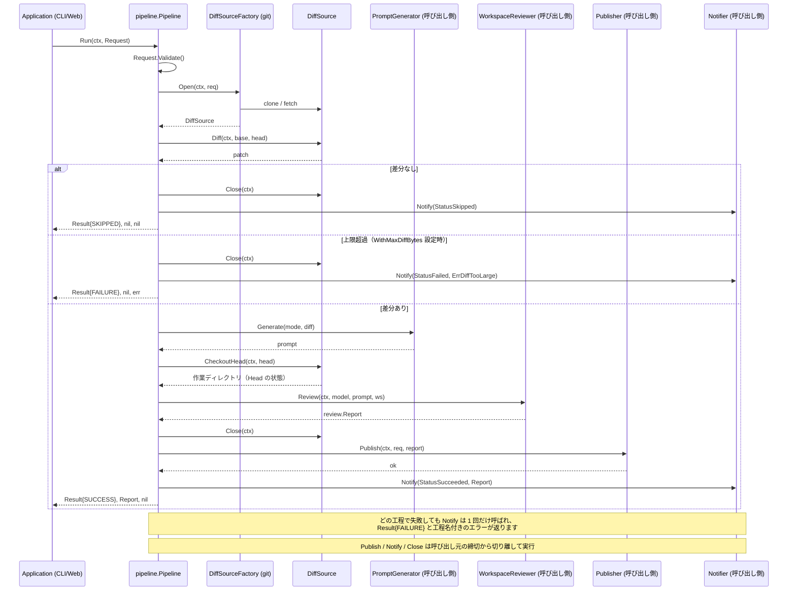

# 🤖 Go Review Kit

[](https://github.com/shouni/go-review-kit/actions/workflows/ci.yml)
[](#)
[](https://go.dev/)
[](https://go.dev/)
[](https://github.com/shouni/go-review-kit/tags)
[](https://opensource.org/licenses/MIT)
[](https://pkg.go.dev/github.com/shouni/go-review-kit)

## 🚀 概要 (About) - 差分を取り、AI に読ませ、保存して、通知するパイプライン

**Go Review Kit** は、「Git の差分を取る → AI にレビューさせる → 結果を保存する → 通知する」を
1 本のパイプラインとして提供するライブラリです。`main` パッケージは持ちません。

レビュー結果は型付きの `review.Report`（判定・重大度付きの指摘）として受け渡し、
`ParseReport` が解釈と検証を引き受けます（補修や切り出しが要ったかは `ParseInfo` で分かります）。レビュアーの実体（`review.WorkspaceReviewer`）は
呼び出し側が差し込みます。AI SDK には依存しないため、コードに限らず Markdown 原稿の
レビューなど、実装次第で用途を変えられます。

### 扱わないこと

**成果物の表現と保存先は呼び出し側の責務です。** JSON で残すのか、HTML に整形するのか、
GCS / S3 / DB のどこへ置くのかは `review.Publisher` の実装が決めます。表示の作りに従属する
決定なので、ライブラリ側に既定を持たせると利用側が要らないレンダリングと依存を抱えます。

同じ理由で、レビュアー（`review.WorkspaceReviewer`）・プロンプトの文面
（`review.PromptGenerator`）・通知先（`review.Notifier`）も呼び出し側が実装します。
どの AI SDK でレビューするかはアプリの選択であり、ライブラリが同梱すると全利用者が
その SDK を抱えるためです。直接依存は `go-git` だけです。

---

## 🎯 特徴 (Key Features)

### Git 操作
* **柔軟な参照解決:** ブランチ名だけでなく、タグやコミットハッシュ（`f921111` 等）を直接
  指定できます。
* **安全な解決順序:** 常に「リモートブランチ → コミット」の順で解決します。数字だけの
  ブランチ名（チケット番号など）が短縮ハッシュとして解決され、意図しないコミットの差分を
  取ってしまうのを防ぎます。
* **3 点比較:** マージベースを起点にするため、base 側で進んだコミットが差分に混ざりません。

### 設計
* **ヘキサゴナルアーキテクチャ:** すべての結合は `review` パッケージのポート経由です。ポートは
  1〜2 メソッドに絞ってあるため、テストのモックは数行で書けます。
* **工程が 1 階層:** `pipeline.Run` が唯一の入口で、その下に中間層はありません。
* **エラーは戻り値:** 失敗は通常の `error` として返り、種類は番兵エラーで判別できます。
* **上限を実測から決められます:** `Result` に差分の大きさ・所要時間・モデルの使用量・
  ツール呼び出し回数が載ります。**失敗した実行でも埋まります。** 上限が厳しすぎるかどうかを
  判断する材料は、通った実行より弾かれた実行の側にあるためです。
* **レビュアーはエージェント型 1 系統:** `WorkspaceReviewer` は Head をチェックアウトした
  作業ディレクトリを自分で調べられます。差分の外を確認できることが前提なので、
  「ファイルを開いて確かめろ」「確認した根拠を挙げろ」と書いたプロンプトが常に成立します。

---

## 📂 プロジェクト構造 (Project Structure)

| カテゴリ | パッケージ | 役割と責務 |
| :--- | :--- | :--- |
| **契約** | **`review`** | ドメイン型・番兵エラー・全ポートの定義。他のどのパッケージにも依存しません。 |
| **実行** | **`pipeline`** | 準備 → 差分 → プロンプト → (Head チェックアウト) → AI → 保存 → 通知 を制御し、結果を返します。 |
| **実装** | **`git`** | `review.DiffSource` の実体。`GoGit` と `CLI` の 2 種類。 |

```text
go-review-kit
├── review/          # 契約
│   ├── request.go   #   Request（Validate で検証、値として受け渡す）
│   ├── report.go    #   Report / Verdict / Finding / Severity / Decision
│   ├── result.go    #   Result / Status（SUCCESS / SKIPPED / FAILURE）
│   ├── errors.go    #   番兵エラーと StepError（工程名付きエラー）
│   └── ports.go     #   WorkspaceReviewer / DiffSource / Publisher / Notifier ほか
├── pipeline/        # 実行：Run(ctx, Request) (Result, *Report, error)
└── git/             # 実装：gogit.go / cli.go / factory.go / options.go / auth.go / refs.go
```

### 対応するリポジトリURL — **SSH のみ**

認証は SSH 鍵だけを扱います（`WithSSHKey` → `GIT_SSH_COMMAND` / go-git の `PublicKeys`）。
受け付けるのは次の形式です。

| 形式 | 例 |
| :--- | :--- |
| scp 形式 | `git@github.com:owner/repo.git` |
| `ssh://` スキーム | `ssh://git@github.com/owner/repo.git` |
| ローカルパス | `/var/tmp/repos/example`（開発・テスト用） |

**`http(s)` は `Prepare` が明示的に断ります。** 資格情報を渡す経路が無く、公開リポジトリへ
匿名で繋がるだけなので、対応しているように見えて private では必ず失敗するためです。
断り方を形式のエラーにしておくと、利用者が「認証に失敗しました」で悩まずに済みます。

同じリポジトリを scp 形式と `ssh://` のどちらで指定しても、同じ作業ディレクトリへ落ち着きます。

### `git` の 2 実装の選び分け

どちらを使うかは呼び出し側が選びます（本ライブラリは選択しません）。

| | `GoGit` | `CLI` |
| :--- | :--- | :--- |
| 実体 | go-git（純 Go） | ローカルの `git` コマンド |
| `git` バイナリ | 不要 | 必要 |
| `Close` の動作 | 作業ディレクトリごと削除 | 基準参照へ戻して未追跡ファイルを削除 |
| 向く環境 | Cloud Run 等の使い捨て環境 | チェックアウトを再利用できるローカル・CI |

> **同じリポジトリのレビューを同時に走らせる場合は `WithDirNamer` が要ります。**
> 既定の作業ディレクトリ名は URL だけから決まるため、同時実行は同じディレクトリを共有します。
> 本ライブラリは排他を行いません。`GoGit` では先に終わった側が実行中の側のディレクトリを消し、
> `CLI` では**エラーにならずに別ブランチの内容をレビューします**。実行ごとに異なる名前を
> 返すようにしてください（チェックアウトの再利用は諦めることになりますが、使い捨ての環境では
> 元々効きません）。

---

## 🧩 使い方 (Usage)

`pipeline.Deps` に実装を差し込んで `Run` を呼びます。

```go
package main

import (
	"context"
	"log"

	"github.com/shouni/go-review-kit/git"
	"github.com/shouni/go-review-kit/pipeline"
	"github.com/shouni/go-review-kit/review"
)

// reviewer / publisher / notifier / prompts は呼び出し側の実装です。
// 実装例は利用側リポジトリ adk-review にあります（レビュアーは internal/adkagent、
// 保存・通知・プロンプトは internal/adapters）。
func run(
	ctx context.Context,
	reviewer review.WorkspaceReviewer,
	publisher review.Publisher,
	notifier review.Notifier,
	prompts review.PromptGenerator,
) error {
	sources, err := git.NewGoGitFactory("/var/tmp/reviews", git.WithSSHKey("~/.ssh/id_ed25519"))
	if err != nil {
		return err
	}

	p, err := pipeline.New(pipeline.Deps{
		Sources:           sources,
		Prompts:           prompts,
		WorkspaceReviewer: reviewer,
		Publisher:         publisher,
		Notifier:          notifier,
	})
	if err != nil {
		return err
	}

	result, report, err := p.Run(ctx, review.Request{
		JobID:      "20260810-213000-a1b2c3d4", // 任意。相関ID
		RepoURL:    "ssh://git@github.com/shouni/example.git",
		Base:       "main",
		Head:       "develop",
		Mode:       "code", // 任意の文字列。意味づけは PromptGenerator の実装が決めます
		Model:      "gemini-2.5-pro",
		StorageURI: "gs://bucket/reviews/20260810-213000-a1b2c3d4/report.json",
		PublicURL:  "https://example.com/history/20260810-213000-a1b2c3d4",
	})
	if err != nil {
		return err
	}

	// report はレビューが成立した場合のみ非 nil です。差分が無ければ nil で返ります。
	findings := 0
	if report != nil {
		findings = len(report.Findings)
	}
	log.Printf("status=%s published=%v duration=%s findings=%d",
		result.Status, result.Published(), result.Duration, findings)
	return nil
}
```

### エラーの判別

工程名はエラー自身が持っているため、別のフィールドと突き合わせる必要はありません。

```go
result, _, err := p.Run(ctx, req)
switch {
case errors.Is(err, review.ErrInvalidRequest):
	// 入力不備
case errors.Is(err, review.ErrRefNotFound):
	// ブランチ・コミットが見つからない（再試行しても直らない）
case errors.Is(err, review.ErrUnsupportedRepoURL):
	// URL の形式が扱えない（同上。SSH 形式かローカルパスにしてもらう）
case errors.Is(err, review.ErrDiffTooLarge):
	// 差分が WithMaxDiffBytes の上限を超えた（同上。範囲を狭めてもらう）
case err != nil:
	log.Printf("%s で失敗しました: %v", review.StepOf(err), err)
}
```

### 相関ID（`JobID`）

`Request.JobID` は**呼び出し側が持つ相関ID**です。本ライブラリは生成も解釈もせず、
`Publisher` / `Notifier` へそのまま渡し、ログ属性 `job_id` に載せるだけです。

ジョブ基盤を持つ呼び出し側が、成果物の保存先や進行状況の記録先を自分で決められるように
するためのもので、書式も一意性も呼び出し側の責務です。未設定でも動作します。

---

## 📐 動作の約束 (Behavioural Contract)

呼び出し側が前提にしてよい取り決めです。

* **モデルが混ぜたノイズは `ParseReport` が吸収します。** 構造化出力を指定しても、モデルは
  Markdown のフェンス、末尾の説明文、エスケープし忘れたバックスラッシュ（ソースの正規表現を
  引用したときに出ます）、生の改行やタブ（複数行を引用したときに出ます）を混ぜることが
  あります。**応答を返しきったあとの崩れなので API の再試行では直りません。**
  そのまま解釈できたときは何もせず、失敗したときだけ補修を試します。補修だけを使いたい場合は
  `review.SanitizeJSON` を直接呼べます。
* **出力が途中で切れた場合は、完結していた範囲だけを拾います。** 出力の上限に当たったモデルは
  文の途中で止まりますが、そこまでの指摘は正しい JSON として並んでいます。全損にする代わりに、
  最後に閉じ終えた要素まで戻して返します。**このとき `ParseInfo.Truncated` が真になります。
  見ずに使うと、切り詰めたレビューを完全なものとして公開することになります。**
* **指摘の並びは呼び出し側が確定させます。** モデルへ「重い順に」と指示しても守られる保証は
  ないため、`Report.SortFindings()` で重大度の重い順（同じ重大度の中は元の順序のまま）に
  並べ替えられます。重さの定義は `Severities()` の並びで、順位表を呼び出し側に持たせません。
* **差分が無いのは失敗ではありません。** `Run` は `StatusSkipped` と `nil` を返します。成果物の
  有無は `Result.Published()` で判別できます。
* **大きすぎる差分は AI へ送る前に落とせます（`pipeline.WithMaxDiffBytes`、既定は無制限）。**
  上限を超えると、レビューを実行せず `review.ErrDiffTooLarge` を包んだエラーで失敗します
  （工程は `review.StepDiff`）。**差分なしと違いスキップではなく失敗です。** 範囲を絞れば
  通る入力なので、利用者に手を打ってもらう必要があり、スキップにすると「レビューはしたが
  指摘が無かった」と見分けが付きません。上限まで切り詰めて送る作りにはしていません。
  モデルは差分の一部だけを見たまま **成功として** レポートを返すため、質の落ちたレビューが
  成果物として残り、落ちるより気付きにくくなります。
* **`Run` はレビュー結果（`*Report`）も返します。** レビューが成立した場合のみ非 nil です。
  保存に失敗した場合は `Report` が非 nil のままエラーも返るため、「レビューはできたが残せ
  なかった」を区別できます。レビューの中身を使う処理（ジョブ状態の記録など）は、`Notifier`
  を実装するのではなくこの戻り値から組み立ててください。**`Notifier` は外向きの通知のための
  もので**、締切の切り離し（下記）が要らない処理をそこへ載せる理由はありません。
* **`Publisher` が呼ばれるのは成功時だけです。** 差分なし・失敗のときは公開する内容が存在しない
  ため、`Notifier` だけが呼ばれます。
* **`Notifier` は `Run` 1 回につき必ず 1 回呼ばれます。** 成功・スキップ・失敗のいずれでも呼ばれ、
  保存に失敗した場合も呼ばれます。報告がいちばん必要な場面で通知が飛ばない、という状態を
  作らないためです。裏を返すと、**`Run` に入る前に呼び出し側で失敗させた場合は呼ばれません**。
  レビュアーの選択などを `Run` の外で行う構成では、その経路の通知は呼び出し側の責任です。
* **通知の失敗はパイプラインを失敗させません。** 成果物は既に保存済みであり、不達を理由に結果を
  失敗へ倒すと再実行の判断を誤らせるためです（記録は残ります）。
* **保存・通知・後始末は呼び出し元の締切から切り離され、それぞれ独立した上限を持ちます。**
  レビューは重く、呼び出し元がタイムアウト付きの context を渡すことがあります。そのまま使うと、
  レビューが打ち切られた直後は context が期限切れなので、失敗を報告する通知や後始末まで
  道連れで失敗します。予算を使い回した場合も同じで、保存が上限まで粘って失敗すると
  失敗通知が必ず不達になります。**いちばん報告が必要な場面でだけ届かない**、という状態を
  作らないためです。上限は `pipeline.WithPublishTimeout` で変更できます。
* **レビュー本体の上限は `pipeline.WithRunTimeout` で設定します（既定は無制限）。**
  `Run` へ渡す context に自分で締切を被せると上の切り離しより外側に掛かり、打ち切りと同時に
  通知も落ちます。ジョブキューの応答待ちより短く取っておくと、外側に打ち切られる前に
  自分から諦めて、失敗を記録・通知してから終われます。
* **作業ディレクトリはレビューを終えた時点で解放されます（保存より前です）。**
  `DiffSource.Close` はレビューを抜けた直後に走るため、`Publisher` から作業ツリーを読むことは
  できません（`GoGit` はここでディレクトリごと削除します）。保存したい内容は `Report` に
  載せてください。
* **`WorkspaceReviewer` が呼ばれる時点で、作業ツリーは Head の状態です。** `Diff` は作業ツリーに
  触れずオブジェクト比較だけで差分を作るため、パイプラインがレビュー直前に
  `DiffSource.CheckoutHead` で明示的にチェックアウトします。

---

## 🔄 シーケンスフロー (Sequence Flow)



---

## 📄 ライセンス (License)

MIT License. 詳細は [LICENSE](LICENSE) を参照してください。
