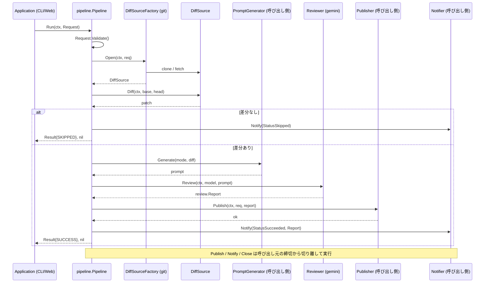

# 🤖 Go Review Kit

[](https://github.com/shouni/go-review-kit/actions/workflows/ci.yml)
[](https://golang.org/)
[](https://golang.org/)
[](https://github.com/shouni/go-review-kit/tags)
[](https://opensource.org/licenses/MIT)
[](https://pkg.go.dev/github.com/shouni/go-review-kit)

## 🚀 概要 (About)

**Go Review Kit** は、「Git の差分を取る → AI にレビューさせる → 結果を保存する → 通知する」を
1 本のパイプラインとして提供するライブラリです。`main` パッケージは持ちません。

AI の出力は Gemini の ResponseSchema で構造を制約したうえで `review.Report` へデコードします。
自由記述の Markdown に起因する出力の揺れが起きないため、コードに限らず Markdown 原稿の
レビューなど、プロンプト次第で用途を変えられます。

### 扱わないこと

**成果物の表現と保存先は呼び出し側の責務です。** JSON で残すのか、HTML に整形するのか、
GCS / S3 / DB のどこへ置くのかは `review.Publisher` の実装が決めます。表示の作りに従属する
決定なので、ライブラリ側に既定を持たせると利用側が要らないレンダリングと依存を抱えます。

同じ理由で、プロンプトの文面（`review.PromptGenerator`）と通知先（`review.Notifier`）も
呼び出し側が実装します。直接依存は `go-git` と `go-gemini-client` の 2 つだけです。

---

## 🎯 特徴 (Key Features)

### Git 操作
* **柔軟な参照解決:** ブランチ名だけでなく、タグやコミットハッシュ（`f921111` 等）を直接
  指定できます。
* **安全な解決順序:** 常に「リモートブランチ → コミット」の順で解決します。数字だけの
  ブランチ名（チケット番号など）が短縮ハッシュとして解決され、意図しないコミットの差分を
  取ってしまうのを防ぎます。
* **3 点比較:** マージベースを起点にするため、base 側で進んだコミットが差分に混ざりません。

### 設計
* **ヘキサゴナルアーキテクチャ:** すべての結合は `review` パッケージのポート経由です。ポートは
  1〜2 メソッドに絞ってあるため、テストのモックは数行で書けます。
* **工程が 1 階層:** `pipeline.Run` が唯一の入口で、その下に中間層はありません。
* **エラーは戻り値:** 失敗は通常の `error` として返り、種類は番兵エラーで判別できます。

---

## 📂 プロジェクト構造 (Project Structure)

| カテゴリ | パッケージ | 役割と責務 |
| :--- | :--- | :--- |
| **契約** | **`review`** | ドメイン型・番兵エラー・全ポートの定義。他のどのパッケージにも依存しません。 |
| **実行** | **`pipeline`** | 準備 → 差分 → プロンプト → AI → 保存 → 通知 を制御します。 |
| **実装** | **`git`** | `review.DiffSource` の実体。`GoGit` と `CLI` の 2 種類。 |
| | **`gemini`** | `review.Reviewer` の実体。ResponseSchema で構造化出力を制約します。 |

```text
go-review-kit
├── review/          # 契約
│   ├── request.go   #   Request（Validate で検証、値として受け渡す）
│   ├── report.go    #   Report / Verdict / Finding / Severity / Decision
│   ├── result.go    #   Result / Status（SUCCESS / SKIPPED / FAILURE）
│   ├── errors.go    #   番兵エラーと StepError（工程名付きエラー）
│   └── ports.go     #   Reviewer / DiffSource / Publisher / Notifier ほか
├── pipeline/        # 実行：Run(ctx, Request) (Result, error)
├── git/             # 実装：gogit.go / cli.go / refs.go / auth.go / factory.go
└── gemini/          # 実装：reviewer.go / schema.go
```

### `git` の 2 実装の選び分け

どちらを使うかは呼び出し側が選びます（本ライブラリは選択しません）。

| | `GoGit` | `CLI` |
| :--- | :--- | :--- |
| 実体 | go-git（純 Go） | ローカルの `git` コマンド |
| `git` バイナリ | 不要 | 必要 |
| `Close` の動作 | 作業ディレクトリごと削除 | 基準参照へ戻して未追跡ファイルを削除 |
| 向く環境 | Cloud Run 等の使い捨て環境 | チェックアウトを再利用できるローカル・CI |

---

## 🧩 使い方 (Usage)

`pipeline.Deps` に実装を差し込んで `Run` を呼びます。

```go
package main

import (
	"context"
	"log"

	"github.com/shouni/go-review-kit/gemini"
	"github.com/shouni/go-review-kit/git"
	"github.com/shouni/go-review-kit/pipeline"
	"github.com/shouni/go-review-kit/review"
)

// publisher / notifier / prompts は呼び出し側の実装です。
func run(
	ctx context.Context,
	publisher review.Publisher,
	notifier review.Notifier,
	prompts review.PromptGenerator,
) error {
	sources, err := git.NewGoGitFactory("/var/tmp/reviews", git.WithSSHKey("~/.ssh/id_ed25519"))
	if err != nil {
		return err
	}

	reviewer, err := gemini.New(ctx, gemini.Options{ProjectID: "my-project"})
	if err != nil {
		return err
	}

	p, err := pipeline.New(pipeline.Deps{
		Sources:   sources,
		Prompts:   prompts,
		Reviewer:  reviewer,
		Publisher: publisher,
		Notifier:  notifier,
	})
	if err != nil {
		return err
	}

	result, err := p.Run(ctx, review.Request{
		JobID:      "20260810-213000-a1b2c3d4", // 任意。相関ID
		RepoURL:    "ssh://git@github.com/shouni/example.git",
		Base:       "main",
		Head:       "develop",
		Mode:       "detail",
		Model:      "gemini-2.5-pro",
		StorageURI: "gs://bucket/reviews/20260810-213000-a1b2c3d4/report.json",
		PublicURL:  "https://example.com/history/20260810-213000-a1b2c3d4",
	})
	if err != nil {
		return err
	}

	log.Printf("status=%s published=%v duration=%s", result.Status, result.Published(), result.Duration)
	return nil
}
```

### エラーの判別

工程名はエラー自身が持っているため、別のフィールドと突き合わせる必要はありません。

```go
result, err := p.Run(ctx, req)
switch {
case errors.Is(err, review.ErrInvalidRequest):
	// 入力不備
case errors.Is(err, review.ErrRefNotFound):
	// ブランチ・コミットが見つからない
case err != nil:
	log.Printf("%s で失敗しました: %v", review.StepOf(err), err)
}
```

### 相関ID（`JobID`）

`Request.JobID` は**呼び出し側が持つ相関ID**です。本ライブラリは生成も解釈もせず、
`Publisher` / `Notifier` へそのまま渡し、ログ属性 `job_id` に載せるだけです。

ジョブ基盤を持つ呼び出し側が、成果物の保存先や進行状況の記録先を自分で決められるように
するためのもので、書式も一意性も呼び出し側の責務です。未設定でも動作します。

---

## 📐 動作の約束 (Behavioural Contract)

呼び出し側が前提にしてよい取り決めです。

* **差分が無いのは失敗ではありません。** `Run` は `StatusSkipped` と `nil` を返します。成果物の
  有無は `Result.Published()` で判別できます。
* **`Publisher` が呼ばれるのは成功時だけです。** 差分なし・失敗のときは公開する内容が存在しない
  ため、`Notifier` だけが呼ばれます。
* **`Notifier` は必ず 1 回呼ばれます。** 成功・スキップ・失敗のいずれでも呼ばれ、保存に失敗した
  場合も呼ばれます。報告がいちばん必要な場面で通知が飛ばない、という状態を作らないためです。
* **通知の失敗はパイプラインを失敗させません。** 成果物は既に保存済みであり、不達を理由に結果を
  失敗へ倒すと再実行の判断を誤らせるためです（記録は残ります）。
* **保存・通知・後始末は呼び出し元の締切から切り離されます。** レビューは重く、呼び出し元が
  タイムアウト付きの context を渡すことがあります。そのまま使うと、レビューが締切で打ち切られた
  直後は context が期限切れなので、失敗を報告する通知や作業ディレクトリの後始末まで道連れで
  失敗します。上限は `pipeline.WithPublishTimeout` で変更できます。

---

## 🔄 シーケンスフロー (Sequence Flow)



---

## 🛠 開発 (Development)

```bash
go build ./...
go test -race ./...
go vet ./...
gofmt -l .

# Lint（CI と同じピン留めバージョン）
go run github.com/golangci/golangci-lint/v2/cmd/golangci-lint@v2.12.2 run ./...

# 脆弱性チェック
go run golang.org/x/vuln/cmd/govulncheck@latest ./...
```

CI（`.github/workflows/ci.yml`）は `main` / `develop` への push と PR で、Build & Test・Lint・
govulncheck を別ジョブとして実行します。

---

## 📄 ライセンス (License)

MIT License. 詳細は [LICENSE](LICENSE) を参照してください。
